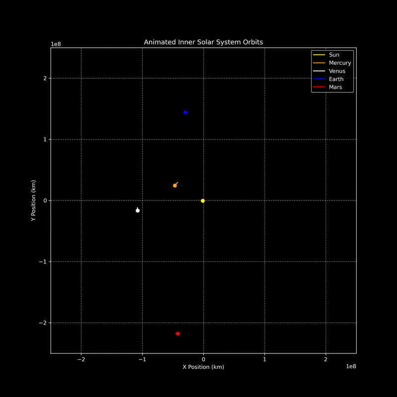

# Inner-Solar-System-Model
An N-body simulation of the inner solar system in Python, featuring a Matplotlib 2D animation and an interactive 3D Plotly model.

*A 15-Second ANimation showing the first 700 days of orbital motion.*

## Tech Stack

* **Language:** Python
* **Libraries:** NumPy, Matplotlib, Plotly
* **Environment:** Jupyter Notebook / JupyterLab

## How to run

### Prerequisites
* An Anaconda distribution of Python 3.x

### Installation
1. Clone the repository:
   `git clone https://github.com/Kyle-Ganaway/Inner-Solar-System-Model.git`
2. Navigate to the project directory and install the necessary packages:
   `pip install plotly ipympl`

### Execution
1. Launch JupyterLab or Jupyter Notebook.
2. Open the `Inner Solar System Model.ipynb` file.
3. Run the cells in order.

## Data Source
All initial state vectors (position and velocity) were sourced from the [NASA JPL Horizons System](https://ssd.jpl.nasa.gov/horizons/app.html#/).

## License
This project is licensed under the MIT License.
